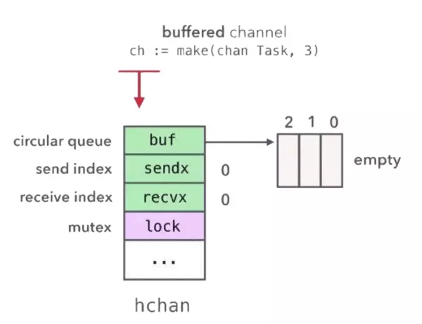
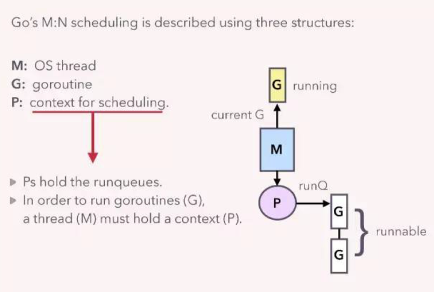
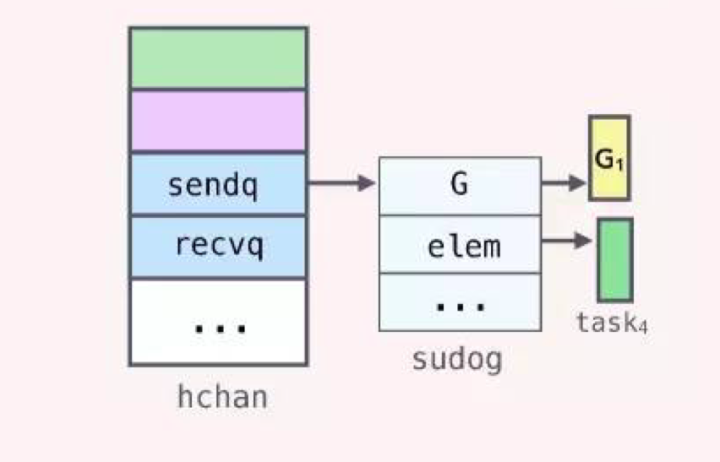
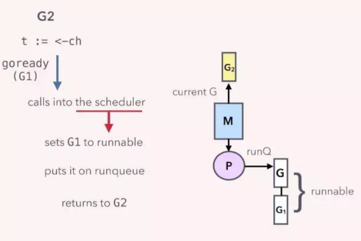
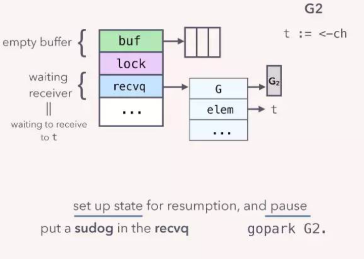

# GO CHANNEL 总结

## 概述
Go: Share Memory By Communicating
章节建议使用Sync.Once和WaitGroup进行协程间通讯，其中**Sync.Once采用atomic实现，WaitGroup采用channel实现**，详细了解Channel会对协程间通讯很有好处
[讲的非常清晰的设计分析（go channel）](../img/GopherCon_v10.0.pdf)

### CSP 模型
CSP 模型全称为 communicating sequential processes，CSP 模型由并发执行实体(进程，线程或协程)，和消息通道组成，实体之间通过消息通道发送消息

### Channel特征
并发（concurrency）是GO语言的重要特征，完成并发功能的是协程（goroutines），在协程间通信，父协程和子协程间通讯都可以通过通道（Channel）来完成。
Channel具备几个特征
* 协程安全的，通过mutex实现
* 存储和传输协程间的数据，共享hchan+数据实现
* 用FIFO队列实现，循环队列实现；chan存放的结构体的长度需要小于65536，当chan
  struct其中struct较大时，尽量采用指针，提高性能
* 可以控制协程的阻塞和运行，goroutine阻塞后自己挂起，对方gotoutine唤醒进入可执行协程队列
* 可执行队列有16个空间（不知道看代码对不对）
* 无缓冲管道，读写协程直接读写对方协程的数据区完成数据共享，并唤醒对方协程进入可执行协程队列中
* sudog是协程队列的

### Channel总结
协程是Go语言的重要特征，协程间通讯是必要内容，Channel便是Go语言提供协程间通讯的一大利器，通过Channel又增加了一些控制功能，Sync.WaitGroup,
context,time.After等功能都是用chan的特征实现的工具。在项目中，合理利用这些工具和Chan本身特性可以更优雅的完成数据共享，协程控制。祝使用愉快！

### Channel的用法
```
    ch := make (chan int, 3)  //创建带有缓冲的管道
    ch := make (chan int)     //创建不带缓冲的管道
    ch <- 10                  //生产数据，当nil或者满时，阻塞
    data <- ch                //消费数据，当nil或者空时，阻塞
    for d := range ch         //支持循环获取管道内容
    close(ch)                 //关闭管道
```

## Channel深入理解

#### Chan 结构
```
//chan的存储结构
type hchan struct {
    qcount   uint           // total data in the queue
    dataqsiz uint           // size of the circular queue
    buf      unsafe.Pointer // points to an array of dataqsiz elements
    elemsize uint16
    closed   uint32
    elemtype *_type // element type
    sendx    uint   // send index
    recvx    uint   // receive index
    recvq    waitq  // list of recv waiters
    sendq    waitq  // list of send waiters

    // lock protects all fields in hchan, as well as several
    // fields in sudogs blocked on this channel.
    //
    // Do not change another G's status while holding this lock
    // (in particular, do not ready a G), as this can deadlock
    // with stack shrinking.
    lock mutex //保证chan的安全，所有字段安全性
}

ch := make (chan int, 3)  //创建带有缓冲的管道
ch := make (chan int)     //创建不带缓冲的管道
```

* `上面两行创建语句，分别创建两个channel，一个带缓存的，一个不带缓存`
* `对应chan.go源代码，make函数在创建channel的时候会在进程的heap区申请一块内存，创建一个hchan结构体，返回执行该内存的指针，获取的ch变量是一个指针，这样传递的是同一个channel（指针保证）。`
* `hchan结构体使用一个环形队列(由dataqsiz,huf共同维护)来保存groutine之间传递的数据(如果是缓存channel的话)，使用两个队列（recvq，sendq）保存'向该chan发送和从该chan接收数据'的goroutine，通过mutex保证结构体数据的协程安全。`
* `环形队列的使用（dataqsiz，buf维护），环形队列降低对内存分配带来的性能损失，提高效率，是一定场景的通用解决方案`

#### 发送和接受
管道（channel）发送和接收数据主要涉及hchan里的成员变量--（sendx，sendq，recvx，recvq，dataqsiz，buf，mutex）

发送队列示例
```

//G1
func main(){
    //带缓冲的channel
    ch := make(chan Task, 3)

    //启动固定数量的worker
    for i := 0; i< numWorkers; i++ {
        go worker(ch)
    }

    //发送任务给worker
    hellaTasks := getTaks()

    //G1 channel程序地址sudog中存在
    for _, task := range hellaTasks {
        ch <- task
    }

    ...
}

//G2
func worker(ch chan Task){
    for {
       //接受任务
       task := <- ch
       process(task)
    }
}
```


代码示例中G1是发送者，G2是接收。ch是长度为3的带缓冲channel，初始的时候hchan结构体的buf是空，sendx和recvx都是0，sendq和recvq都是空队列，当G1向ch里发送数据时，会**先对buf加锁，然后将要发送的数据copy到buf里，并增加sendx的值，最后释放buf的锁**。G2消费的时候先**对buf加锁，然后将buf里的数据copy到task变量对应的内存里，增加recvx，最后释放锁**。整个过程，G1和G2没有共享的内存，底层通过hchan结构体的buf，使用copy内存的方式进行通信，最后达到了共享内存的目的，这完全符合CSP的设计理念

`Do not communicate by sharing memory; instead, share memory by
communicating.`

`直译：不要通过共享内存来通信，而应该通过通信来共享内存；转变了沟通模式，一种是监控数据变化，一种是等待通知，后者在成本上低于前者`

#### 协程阻塞和唤醒(Goroutine Pause/Resume)
消费者（G2）速度慢于生产者（G1）速度时，结构体hchan中的buf数据会越来越多，当buf数据充满后，当G1再次向ch里发送数据，这时G1会发生阻塞，那么阻塞到底是发生了什么呢？

###### 理解协程（goroutine）调用，需要先理解GO语言协程机制

go 内部有三个对象：
- G (Goroutine)，代表协程，也就是每次代码中使用 go 关键词时候会创建的一个对象（用户维护）
- M (Work Thread)，工作线程（操作系统维护）
- P
  (Processor)，代表一个处理器，又称上下文，（**调度上下文，每个M都会分配到一个P中，P维护一个可运行的goroutine队列，调度到M中执行**）

正常情况下一个cpu对象启一个工作线程对象，线程去检查并执行goroutine对象。碰到goroutine对象阻塞的时候，会启动一个新的工作线程，以充分利用cpu资源。所有有时候线程对象会比处理器对象多很多，这些都在GO的runtime环境中完成。

相关的数据结构图:



当G1向buf已经满了的ch发送数据的时候，当检测到对应的hchan的buf满了，会通知调度器，调度器会将G1的状态设置为waiting,
移除与线程M的联系，然后从P的runqueue中选择一个goroutine在线程M中执行，此时G1就是阻塞状态，这个调度在GO的runtime环境完成，需要资源小于操作系统的线程开销。

G1设置为waiting状态后，需要被唤醒（Resume），是如何实现的呢？回到hchan结构体的sendq，recvq成员。源码如下：
```
type hchan struct { 
    ... 
    recvq waitq // list of recv waiters 
    sendq waitq // list of send waiters 
    ... 
} 
// 
type waitq struct { 
    first *sudog 
    last *sudog 
} 
```
当G1成为waiting状态时，会创建自己的sudog结构，将这个sudog结构放到sendq队列中，sudog结构中保存channel相关的**变量的指针**（生产者（sender）保存发送数据变量的指针，接受者（receiver）保存接受数据变量的指针，注意这里的指针：**当调度时，会发生数据拷贝，直接从发送者和消费者的数据块拷贝到对方数据中，chan.go代码中的sendDirect，recvDirect方法**）

相关的数据结构图：注意图中的task4绿色部分，会被用作内存拷贝地址



当G2从ch中接收一个数据时，会通知调度器，设置G1的状态为runnable（唤醒resume先前阻塞的G1协程），然后将加入P的runqueue里，等待线程执行。



上面说的是生产者阻塞，下面说一下消费者阻塞：消费者先于生产者执行，会从一个空的通道中获取数据，此时也会发生阻塞

G2先于G1执行，会从一个empty的channel里取数据，这时G2会发生阻塞，和前面介绍的G1阻塞一样，

当G2成为waiting状态时，也会创建自己的sudog结构，将这个sudog结构放到recvq队列中，sudog结构体保存channel相关的**变量的指针**（接受者（receiver）保存接受数据变量的指针），当G1向ch发送数据时，直接将G1里的发送到ch的数据copy到G2数据地址上，runtime并不需要对hchan结构体进行加锁



## Channel的使用场景

### promise/future异步模型
```
func main() {
    ch1 := make(chan int)
    ch2 := make(chan int)
    go func() {
        ch1 <- 10 //给一个10
    }()

    go func() {
        ch2 <- 5 //给一个5
    }()

    d1 := <- ch1
    d2 := <- ch2
    d := d1 + d2 //从两处获得的数据相加
    fmt.Println(d, d1, d2)
}
```

### 广播信息
利用channel关闭状态改变时，所有监听关闭的channel协程，可以并发获得channel的关闭状态。用于Go Connext的父子协程关闭通讯，父协程退出时，优雅的退出子协程
```
func main() {
    N := 10
    S := time.Now()
    exit := make(chan int)
    done := make(chan int, N)

    // start N worker goroutines
    for i := 0; i < N; i++ {
        go func(n int) {
            for {
                select {
                // wait for exit signal
                case <-exit:
                    fmt.Printf("worker goroutine #%d exit\n", n)
                    done <- rand.Intn(100)
                    return
                case <-time.After(3 * time.Second):
                    done <- rand.Intn(100)
                    fmt.Printf("worker goroutine #%d is working...\n", n)
                }
            }
        }(i)
    }

    go func() {
        //time.Sleep(4 * time.Second)
        time.Sleep(1 * time.Second)
        // broadcast exit signal
        close(exit)
    }()

    // wait for all worker goroutines exit
    for i := 0; i < N; i++ {
        <-done
        elapsed := time.Since(S)
        fmt.Println("App elapsed: ", elapsed)
    }
    elapsed := time.Since(S)
    fmt.Println("App elapsed: ", elapsed)
    fmt.Println("main goroutine exit")
}
```

### 信号量
P-V操作原语

P操作原语： semaphore 减1 若semaphore 大于等于0，线程继续执行；若semaphore < 0 ，线程进入阻塞队列.

V操作原语： semaphore 加1 若semaphore 大于 0, 线程继续执行；若semaphore 小于等于0,唤醒阻塞队例的线程

用channel的阻塞，控制协程的运行

```
func main() {
    var wg sync.WaitGroup

    sem := make(chan struct{}, 2) // 最多允许2个并发同时执行
    taskNum := 10

    for i := 0; i < taskNum; i++ {
        time.Sleep(time.Second)   // 控制产生频率，模拟数据
        wg.Add(1)
        go func(id int) {
            defer wg.Done()

            sem <- struct{}{}        // 获取信号
            defer func() { <-sem }() // 释放信号

            // do something for task
            time.Sleep(time.Microsecond * time.Duration(500+rand.Intn(100)))
            fmt.Println(id, time.Now().Format("2006-01-02 15:04:05"))
        }(i)
    }
    wg.Wait()
}
```

### 互斥量

互斥锁mutex（也称之为互斥量），每个线程在资源操作前尝试先加锁，成功加锁才能操作，操作结束解锁。资源是共享的，线程间是竞争的，通过“锁”就将资源的访问变成互斥操作，避免同时对资源进行写操作，造成错误。
```
func main() {
    var wg sync.WaitGroup
    mutex := make(chan struct{}, 1) // the capacity must be one

    counter := 0
    increase := func() {    //通过chan的阻塞，做互斥锁
        mutex <- struct{}{} // lock
        counter++
        <-mutex // unlock
    }

    increase100 := func(wg *sync.WaitGroup) {
        defer wg.Done()
        for i := 0; i < 100; i++ {
            increase()
        }
    }

    wg.Add(2)
    go increase100(&wg)
    go increase100(&wg)
    wg.Wait()
    fmt.Println(counter) // 200
}
```

### 一发多收

一个协程负责生产，两个协程负责消费，协程工作完后让出时间片，是的协程看上去消费更均匀（其实没啥用）
```
func main() {
    var wg sync.WaitGroup
    ch := make(chan int, 10)

    send := func() {
        for i := 0; i < 10; i++ {
            ch <- i
        }
        close(ch)
    }

    recv := func(id int) {
        defer wg.Done()
        for i := range ch {
            fmt.Printf("receiver #%d get %d\n", id, i)
            runtime.Gosched()  //让出时间片，让接受者均衡接受
        }
        fmt.Printf("receiver #%d exit\n", id)
    }

    go send()

    wg.Add(2)
    go recv(1)
    go recv(2)
    wg.Wait()
}
```

### 多发一收

```
func main() {
    var wg sync.WaitGroup

    ch := make(chan int, 10)
    done := make(chan struct{})

    send := func(id int) {
        defer wg.Done()
        for i := 0; ; i++ {
            select {
            case <-done:
                // get exit signal
                fmt.Printf("sender #%d exit\n", id)
                return
            case ch <- id*10 + i:
            }
            runtime.Gosched()
        }
    }

    recv := func() {
        count := 0
        for i := range ch {
            fmt.Printf("receiver get %d\n", i)
            count++
            if count >= 10 {
                // signal recving finish
                close(done)
                return
            }
        }
    }

    wg.Add(2)
    go recv()
    go send(1)
    go send(2)

    wg.Wait()
}
```

### 多发多收

```
func main() {
    wg := &sync.WaitGroup{}
    ch := make(chan int, 100)
    done := make(chan struct{})

    send := func(id int) {
        defer wg.Done()
        for i := 0; ; i++ {
            select {
            case <-done:
                // get exit signal
                fmt.Printf("sender #%d exit\n", id)
                return
            case ch <- id*1000 + i:
            }
        }
    }

    recv := func(id int) {
        defer wg.Done()
        for {
            select {
            case <-done:
                // get exit signal
                fmt.Printf("receiver #%d exit\n", id)
                return
            case i := <-ch:
                fmt.Printf("receiver #%d get %d\n", id, i)
                time.Sleep(time.Millisecond)
            }
        }
    }

    wg.Add(6)
    go send(0)
    go send(1)
    go send(2)
    go recv(0)
    go recv(1)
    go recv(2)

    time.Sleep(time.Second)
    // signal finish
    close(done)
    // wait all sender and receiver exit
    wg.Wait()
}
```

### 参考
- [Understanding Channels-author:kavya](https://about.sourcegraph.com/go/understanding-channels-kavya-joshi/)
- [深入理解Golang Channel](https://zhuanlan.zhihu.com/p/27917262)
- [如何理解 Golang 中“不要通过共享内存来通信，而应该通过通信来共享内存”](https://www.zhihu.com/question/58004055)
- [go channel 使用总结](https://www.cnblogs.com/tobycnblogs/p/9935465.html)

###标题
* 内容
> 引用 
```
    code
```


[文字](文字连接)

| 表--------格 | 左--------对--------齐 |右--------对--------齐 |
| :-: | :-- | --: |
| 居中 | 左对齐 | 左对齐 |
| 居中 | 左对齐 | 左对齐 |
